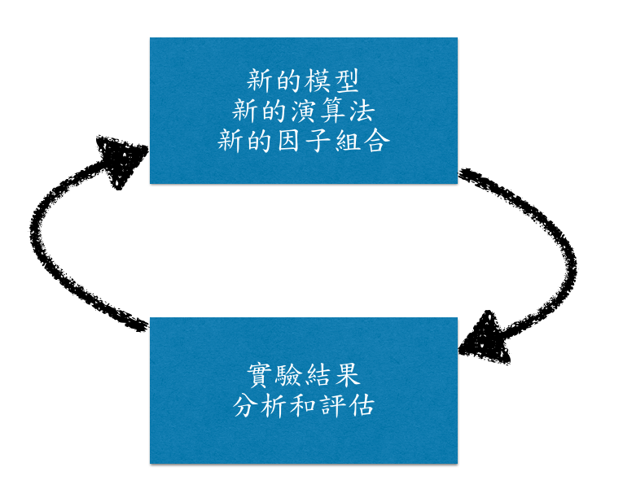

---
title       : R語言的工程面
subtitle    : 
author      : Wush Wu
job         : Taiwan R User Group
framework   : io2012        # {io2012, html5slides, shower, dzslides, ...}
highlighter : highlight.js  # {highlight.js, prettify, highlight}
hitheme     : zenburn      # 
widgets     : []            # {mathjax, quiz, bootstrap}
mode        : selfcontained # {standalone, draft}
--- &vcenter .large

<script>var youtube_entered = {};</script>
```{r setup, include=FALSE,echo = F, message = F, warning = F, tidy = F, cache=FALSE}
# make this an external chunk that can be included in any file
library(xtable)
library(rbenchmark)
library(reshape2)
library(knitr)
library(methods)
options(width = 100,digits=3)
opts_chunk$set(message = FALSE, eval=TRUE,fig.align = "center", warning = FALSE, comment = NA, dpi = 100, fig.width=6, fig.height=4.5,tidy = FALSE, cache = FALSE, echo=FALSE)

options(xtable.type = 'html')
knit_hooks$set(inline = function(x) {
  if(is.numeric(x)) {
    round(x, getOption('digits'))
  } else {
    paste(as.character(x), collapse = ', ')
  }
})
knit_hooks$set(plot = knitr:::hook_plot_html)
```

R 是最火熱的分析工具之一

--- &vcenter .large

要有資料，才能分析

--- &vcenter .large

需要資料工程

才能不停的取得及時、可分析的資料

--- &twocolvcenter

*** =left

## 關於講者

- Wush Wu
- Taiwan R User Group 創辦人
- 喜歡用R 解決問題
- 快樂的研究人員
    - 預測網路廣告的點擊行為
- 快樂的碼農

*** =right


--- &vcenternobg .large


Taiwan R User Group

MLDMMonday: 每週一分享資料相關議題

主題包含但不限於：

R 套件使用

機器學習和統計模型

http://www.meetup.com/Taiwan-R

--- &vcenter .large

Outline

1. 定時進行資料的ETL和雲端資料庫的同步
1. 定時運作的學習系統
1. 自動在雲端布署實驗系統
1. 自製和管理R的套件
1. 利用客製化的Dashboard來監控系統成效
1. R 套件和CI(Continuous Integration)
1. 利用CRAN套件進行系統狀態的通知

--- .segue .dark

## <div>定時進行資料的ETL</br></br>和雲端資料庫的同步</div>

--- &vcenter .large

Extract, Transform, and Load


想要我的財寶嗎？想要的話可以全部給你

去爬吧！我把所有的資訊都放在那裡了。

--- &vcenter .large

基礎工程能力

請期待社群接下來的線上、實體課程


--- &vcenter .large

給一些資料源

`impression201406012300.txt`

製作一個R script處理檔案並不難

```r
in_path <- readLines("impression2014060123.txt")
# 我爬, 我爬, 我爬爬爬
saveRDS(out, "out.Rdata")
```

--- &vcenter .large

資料源是資料庫?

R 有豐富資料庫相關的套件

```{r db_wordcount, echo=FALSE, eval=TRUE}
library(wordcloud)
pkg.db <- readRDS("db.Rds")
.par <- par()
par(cex = 2)
pal <- c("#E41A1C", "#377EB8", "#4DAF4A", "#984EA3",
  "#FF7F00", "#FFFF33", "#A65628", "#F781BF", "#999999")
wordcloud(pkg.db$package, freq=pkg.db$count, 
          vfont=c("serif","plain"), colors=pal)
par(.par)
```

--- &vcenter .large

但是資料一直在變化

需要把一次性的工作變成持續性

需要讓工作能夠自動化

--- &youtube yt:A1IIcZW5UrI

--- &vcenter .large

定時啟動系統:

### crontab，工作排程
### jenkins 

--- &vcenter .large

利用時間建立不同的行為

R 有豐富的時間相關工具函數

```{r posix_wordcount, echo=FALSE, eval=TRUE}
library(wordcloud)
pkg.posix <- readRDS("posix.Rds")
.par <- par()
par(cex = 0.5, oma = rep(0, 4), mar = rep(0, 4))
pal <- c("#E41A1C", "#377EB8", "#4DAF4A", "#984EA3",
  "#FF7F00", "#FFFF33", "#A65628", "#F781BF", "#999999")
x <- c("Sys.time", "Sys.Date", "cut.Date", "c.Date", "seq.Date", "format.Date",
       "round.Date", "trunc.Date", "weekday.Date", "months.Date", "ISOdate",
       "date", "julian.Date", "Math.Date", "Ops.Date", "summary.Date", "strptime")
wordcloud(x, sample(5:10, length(x), TRUE),   
          vfont=c("serif","plain"), colors=pal)
par(.par)
```

--- &vcenter .large 

事情不會永遠美好...

我們需要寫記錄(Log)

我們需要處理錯誤


--- &vcenter .large

R 也有許多寫log用的套件

```{r log_wordcount, echo=FALSE, eval=TRUE}
library(wordcloud)
pkg.log <- readRDS("log.Rds")
.par <- par()
par(cex = 1.5, oma = rep(0, 4), mar = rep(0, 4))
pal <- c("#E41A1C", "#377EB8", "#4DAF4A", "#984EA3",
  "#FF7F00", "#FFFF33", "#A65628", "#F781BF", "#999999")
wordcloud(names(pkg.log), freq=pkg.log,
          vfont=c("serif","plain"), colors=pal)
par(.par)
```

--- &vcenter .large

除錯後，需要追回耽誤的工作

R 也有豐富的檔案系統相關工具

```{r file_wordcount, echo=FALSE, eval=TRUE}
library(wordcloud)
.par <- par()
par(cex = 1, oma = rep(0, 4), mar = rep(0, 4))
pal <- c("#E41A1C", "#377EB8", "#4DAF4A", "#984EA3",
  "#FF7F00", "#FFFF33", "#A65628", "#F781BF", "#999999")
wordcloud(c("file.info", "dir", "file.rename", "file.copy", "file.exists",
            "file_ext", "normalizePath", "system.file", "gzfile", "fileSnapshot"),
          sample(6:10, 10, TRUE), vfont=c("serif","plain"), colors=pal)
par(.par)
```

--- &vcenter .large

為了和雲端(AWS S3)同步

python 有 [boto](http://boto.readthedocs.org/en/latest/)

command line 有 [awscli](http://aws.amazon.com/cn/cli/)

R 可以站在這些工具上

--- &vcenter .large

R 提供`system`來呼叫命令列程序

```r
cmd <- sprintf("aws s3api put-object --bucket %s --key %s --body %s %s %s",
  bucket, key, path, md5base64, class)
retval <- system(cmd, return = TRUE)
```

回傳結果的JSON

可以利用`rjson`來處理

```r
library(rjson)
fromJSON(retval)
```

--- &vcenter .large

一次性的程序和自動化程序的距離：

### 利用如jenkins等定時啟動器透過命令列呼叫Rscript

### 需要依賴時間做出不同的行為

### 能夠檢查先前的結果是否有誤

### 利用如logging等套件進行記錄

--- &vcenter .large

R 的擴充性

### 大量的套件提供的功能

### 利用`system`和字串處理來擴充功能

--- .segue .dark

## <div>定時運作的學習系統</br>

--- &vcenter .large

已經有`定時`、`自動化`的R 程式

--- &vcenter .large

我們可以來談談更複雜的需求

--- &vcenter .large

機器學習的模型有很多參數

參數需要調整

--- &vcenter .large

我們應該不想看到:

```
.
|--- LR_Scripts
    |--- logistic_regression_C_0.1.R
    |--- logistic_regression_C_0.1_Neg_Sample.R
    |--- logistic_regression_C_0.5.R
    |--- logistic_regression_C_1.0.R...
```

--- &vcenter .large

R 的程序是可以吃參數的

```{r argv}
argv <- commandArgs()
print(argv)
```

--- &vcenter .large

更可以利用套件如`optparse`

增強命令列參數的功能

### 預設參數
### 必要參數與可忽略參數
### 參數的說明

--- &vcenter .large

```{r optparse, eval=FALSE, echo=TRUE}
library(optparse)
opt <- parse_args(OptionParser(option_list=list(
  make_option("--C", default=1.0, help="The value of regularization parameter"),
  make_option("--NegSample", default=FALSE, help="Whether sample the negative data")
  )))
```

```{r optparse2, echo=FALSE, warning=FALSE}
cat(paste(system("Rscript optparse.example.R --help", intern=TRUE), collapse="\n"))
```

--- &vcenter .large

部署機器學習的結果時

很可能需要和其他工具溝通

透過資料庫很方便

--- &vcenter .large

R 擁有豐富的資料庫相關套件

```{r db_wordcount2, echo=FALSE, eval=TRUE}
library(wordcloud)
pkg.db <- readRDS("db.Rds")
.par <- par()
par(cex = 2)
pal <- c("#E41A1C", "#377EB8", "#4DAF4A", "#984EA3",
  "#FF7F00", "#FFFF33", "#A65628", "#F781BF", "#999999")
wordcloud(pkg.db$package, freq=pkg.db$count, 
          vfont=c("serif","plain"), colors=pal)
par(.par)
```

--- &vcenter .large

也可以透過Rcpp + Boost Serialization

和其他工具傳遞Binary

--- &vcenter .large

更複雜的自動化工作

### 可利用命令列參數來調整行為
### 可利用資料庫和其他工具溝通

--- .segue .dark

## <div>自動在雲端布署實驗系統</br>

--- &vcenter .large

模型的參數需要調整

--- &vcenter .large

調整參數需要實驗

--- &vcenter .large

如何有效率的進行大量實驗

攸關企業的競爭力



--- &vcenter .large

跑實驗需要臨時性的運算資源

現在有許多雲端解決方案

提供彈性的運算資源

--- &vcenter .large

R 和AWS 的整合則較為間接

--- &vcenter .large

透過預先設定好的AMI

以及上述的AWSCLI

和命令列參數的整合

可以自動開出任意數量的虛擬機器跑實驗

--- &vcenter .large

訣竅和上述介紹的方法雷同

只是應用上更為複雜

--- &vcenter .large

```r
obj@env$spot_request <- ec2_request_spot_instances(
  obj@price,
  obj@count,
  local({
    j <- gen_instance_spec(obj@key.name, obj@instance_type, list(obj@key.name), obj@ami)
    j$BlockDeviceMappings <- list(list(DeviceName = "/dev/sdf", Ebs = list(VolumeSize = 50L)))
    j
  })
  )
loginfo(sprintf("spot request id: %s", paste(get_spot_request_id(obj@env$spot_request), collapse=",")))
obj@env$instance_ids <- wait_spot_request(get_spot_request_id(obj@env$spot_request))
loginfo(sprintf("instance id: %s", paste(obj@env$instance_ids, collapse=",")))
obj@env$instances <- wait_instance_running(obj@env$instance_ids)
```

--- &vcenter .large

太過複雜的功能

使用一個個Scripts來管理非常不方便

```r
library(optparse)
library(logging)
source("/home/wush/ec2/ec2_request_spot_instances.R")
source("/home/wush/ec2/get_spot_request_id.R")
source("ssh_agent.R")
source("learning.R")
# ...
```

--- &vcenter .large

在雲端上部署實驗環境也不方便

```{r source_error, echo=TRUE}
source("learning.R")
```

--- .segue .dark

## <div>自製和管理R的套件</div>

--- &vcenter .large

散布R 應用到其他機器

需要用套件(package)

並且解決不同系統間的路徑問題

```{r RAWSCLI, eval=TRUE, echo=TRUE, results='markup'}
library(RAWSCLI)
```

--- &vcenter .large

只要用到對的工具

目前自製R 套件非常的容易

--- &youtube yt:OCQU6M4pPiw

--- &vcenter .large

把跑機器學習的Scripts包成套件

讓雲端上的AMI來安裝套件

把寫好的R Scripts部署到雲端上

--- &vcenter .large

利用`.Rprofile`可以指向預設的套件庫

```r
options(repos=structure(c(
  My_R_Repository="http://xxx.xxx.xxx.xxx",
  CRAN="http://cran.csie.ntu.edu.tw/", 
  omegahat="http://www.omegahat.org/R"
  )))
```

--- &vcenter .large

架設R 的Private Repository很容易

Web Server

`tools::write_PACKAGES`

```r
## Not run: 
write_PACKAGES("c:/myFolder/myRepository")  # on Windows
write_PACKAGES("/pub/RWin/bin/windows/contrib/2.9",
               type = "win.binary")  # on Linux

## End(Not run)
```

--- &vcenter .large

利用Jenkins + git + R

自動部署至Private Repository


--- .segue .dark

## <div>利用客製化的Dashboard</br></br>來監控系統成效</div>

--- &vcenter .large

2012年Rstudio Inc.發佈了[Shiny](http://shiny.rstudio.com/)套件

R 使用者已經可以開發簡單的網頁應用

--- &youtube yt:3Y81BCQvd-o

--- &vcenter .large

利用R 定時分析資料

再利用[Shiny Server](http://www.rstudio.com/products/shiny/shiny-server/)

搭建Dashboard應用服務


--- &vcenter .large

搭配R 強大的繪圖功能

```{r figure_wordclout, echo=FALSE, cache=TRUE}
suppressPackageStartupMessages({
  library(data.table)
  library(dplyr)
  library(wordcloud)
})
pkgstat <- readRDS("pkgstat_download.Rds")
pkg <- c("ggplot2", "googleVis", "plotCI", "webvis", "RnavGraph", 
         "rgl", "shiny", "VizOR", "arulesViz", "corrplot",
         "spc", "IQCC", "qcc", "animation", "biOps", "RgoogleMaps")
pkgstat <- summarise(group_by(pkgstat, package), count=length(date))
pkgstat <- filter(pkgstat, package %in% pkg)
.par <- par()
par(cex = 2)
pal <- c("#E41A1C", "#377EB8", "#4DAF4A", "#984EA3",
  "#FF7F00", "#FFFF33", "#A65628", "#F781BF", "#999999")
wordcloud(pkgstat$package, log(pkgstat$count, 2), 
          vfont=c("serif","plain"), colors=pal)
par(.par)
```

--- &vcenter .large

Shiny 的使用上，社群也有許多學習資源

--- &youtube yt:3Y81BCQvd-o

--- .dark .segue

## R 套件和CI(Continuous Integration)

--- &vcenter .large

R 的套件原始碼

可以利用git來管理


--- &vcenter .large

R 本身備有以下套件相關的功能：

打包

測試

部署

能和CI工具整合

--- &vcenter .large

`R CMD check` 就可以運作各種測試

`RUnit`, `testthat`, `svUnit`

協助寫單元測試

--- &vcenter .large

R + Web Service(如: Apache)

建立私有Repository

CI工具部署套件至私有Repository

再通知其他機器更新套件

--- &vcenter .large

[Jenkins](http://jenkins-ci.org/) + [gitosis]()


--- &vcenter .large

Jenkins 已有支援R 的Plugin


--- &vcenter .large

另一個CI的工具：

[Github](https://github.com) + [travis CI](https://travis-ci.org/)


--- &vcenter .large

Work Flow

### 本地端開發完成，更新版本，git push到git repository

### jenkins獲知git repository已更新，開始套件的測試

### 套件測試通過，利用`R CMD`部署套件到私有R Repository

### 連線到其他機器，自動更新到最新版本的套件

--- &vcenter .large

出現錯誤，需要退版

可以指定需要安裝的套件版本

`base::numeric_version`

--- .dark .segue

## 利用CRAN套件進行系統狀態的通知

--- &vcenter .large

當出現嚴重錯誤時

若我們希望能及時收到通知

可以利用如`RMessenger`等套件


--- &vcenter .large

R 可以自定錯誤發生後的行為

```r
options(error = function() {
  library(RMessenger)
  sendXMPPMessage("sender@gmail.com", "senderpass", "your@gmail.com", 
                  geterrmessage())
})
```

--- &vcenter .large

感謝各位的聆聽

Q&A

