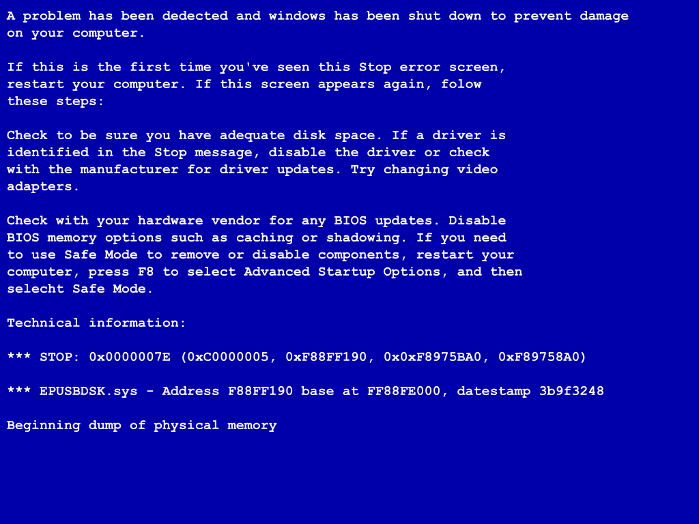
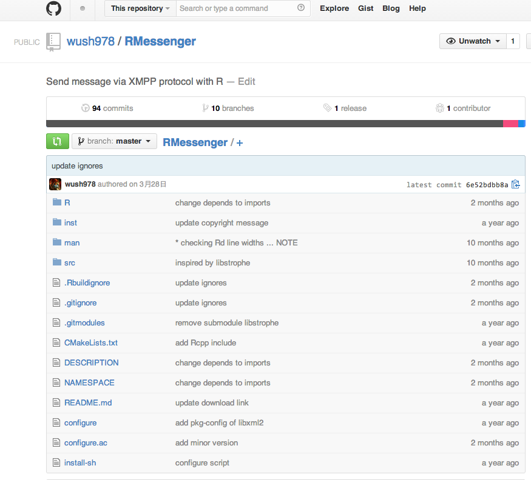
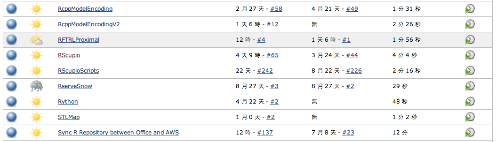

---
title       : R語言的工程面
subtitle    : 
author      : Wush Wu
job         : Taiwan R User Group
framework   : io2012        # {io2012, html5slides, shower, dzslides, ...}
highlighter : highlight.js  # {highlight.js, prettify, highlight}
hitheme     : zenburn      # 
widgets     : []            # {mathjax, quiz, bootstrap}
mode        : selfcontained # {standalone, draft}
--- &vcenter .large

R 是最火熱的分析工具之一

--- &vcenter .large

有時候

我們需要分析不停變動的資料

--- &vcenter .large

需要有資料工程

才能不停的取得分析用的資料

--- &vcenter .large

今天以親身經驗跟大家介紹

我所建立的數個以R 為核心的系統

--- &vcenter .large

Outline

1. 定時進行資料的ETL以及和雲端資料庫的同步
2. 定時的機器學習系統建立服務所需的模型
3. 自動在雲端布署學習系統來進行電腦實驗及數據分析以改進機器學習的效能
4. 利用客製化的Dashboard來監控系統成效
5. 利用jenkins達成R 套件的自動測試和布署
6. 利用講者自行開發的CRAN套件進行系統狀態的通知

--- .segue .dark

## <div>定時進行資料的ETL以及</br></br>和雲端資料庫的同步</div>

--- &vcenter .large

ETL


--- &vcenter .large

讀取檔案的具體步驟

請期待R Tutorial系列課程

--- &vcenter .large

給一個檔案: 

`impression201406012300.txt`

製作一個R script讀取該檔案:

```r
in_path <- "impression2014060123.txt"
# ...
saveRDS(out, "out.Rdata")
```

--- &vcenter .large

需要定時啟動器

需要依據時間做不同的變化

--- &vcenter .large

定時啟動系統:

### crontab，工作排程 
### jenkins 

再利用`Rscript`透過命令列來啟動R 執行指定的Script

--- &vcenter .large

利用時間建立不同的行為

`Sys.time` + `format`

```r
saveRDS(out, 
  sprintf(
    "out%s.Rdata", 
    format(Sys.time(), "%Y%m%d%H")
  ))
```

--- &vcenter .large 

事情不會永遠美好...

我們需要寫記錄(Log)

我們需要處理錯誤



--- &vcenter .large

`logging` 

一個R 中寫log的套件

```r
library(logging)
basicConfig("DEBUG")
logdebug("DEBUG")
loginfo("INFO")
logwarn("WARN")
logerror("ERROR")
```

--- &vcenter .large

除錯後，需要追回耽誤的工作

需要一個檢查工作是否完成的機制: `file.exists`

```r
current <- Sys.time()
for(i in 0:23) {
  target_time <- current - 3600 * i
  check_result <- file.exists(sprintf(
    "out%s.Rdata", 
    format(Sys.time(), "%Y%m%d%H")
  ))
  # ...
}
```

--- &vcenter .large

和雲端(AWS S3)同步

需要客戶端(Client)

但是R 可能沒有好的客戶端套件

--- &vcenter .large

R 提供`system`來呼叫命令列程序

可傳遞命令列參數

並且接收程序的回傳值，或截取stdout

可用於檢查是否有錯

--- &vcenter .large

可利用[AWS CLI](http://aws.amazon.com/cn/cli/)自動將資料上傳S3

```r
cmd <- sprintf("aws s3api put-object --bucket %s --key %s --body %s %s %s",
  bucket, key, path, md5base64, class)
retval <- system(cmd, return = TRUE)
```

回傳結果的JSON，也可以利用rjson來處理

--- &vcenter .large

一次性的程序和自動化程序的距離：

### 利用如jenkins等定時啟動器透過命令列呼叫Rscript

### 需要依賴時間做出不同的行為

### 能夠檢查先前的結果是否有誤

### 利用如logging等套件進行記錄

--- &vcenter .large

R 的擴充性

### 大量的套件提供的功能

### 利用`system`和字串處理來擴充功能

--- .segue .dark

## <div>定時的機器學習系統</br></br>建立服務所需的模型</div>

--- &vcenter .large

我們已經談過如何建立`定時`、`自動化`的R 程序

--- &vcenter .large

我們可以來談談更複雜的需求

--- &vcenter .large

模型常常需要調整

需要參數來控制模型的學習

--- &vcenter .large

我們應該不想看到:

```
.
|--- LR_Scripts
    |--- logistic_regression_C_0.1.R
    |--- logistic_regression_C_0.1_Neg_Sample.R
    |--- logistic_regression_C_0.5.R
    |--- logistic_regression_C_1.0.R...
```

--- &vcenter .large

R 的程序是可以吃參數的


```r
argv <- commandArgs()
print(argv)
```

```
## [1] "/opt/local/Library/Frameworks/R.framework/Resources/bin/exec/R"
## [2] "--slave"                                                       
## [3] "--no-restore"                                                  
## [4] "-e"                                                            
## [5] "library(slidify);slidify('index.Rmd')"                         
## [6] "--args"
```

--- &vcenter .large

更可以利用套件如`optparse`

增強命令列參數的功能

### 預設參數
### 必要參數與可忽略參數
### 參數的說明

--- &vcenter .large


```r
library(optparse)
opt <- parse_args(OptionParser(option_list=list(
  make_option("--C", default=1.0, help="The value of regularization parameter"),
  make_option("--NegSample", default=FALSE, help="Whether sample the negative data")
  )))
```

--- &vcenter .large

模型需要部署到前端的服務器上

服務器不是R (如[nodejs](http://nodejs.org/))

透過資料庫(如:[MongoDB](http://www.mongodb.org/))會比較方便


--- &vcenter .large

可以利用[rmongodb](https://github.com/mongosoup/rmongodb)達成任務


--- &vcenter .large

更複雜的自動化工作

### 可利用命令列參數來調整行為
### 可利用資料庫和其他工具溝通

--- .segue .dark

## <div>自動在雲端布署學習系統</br></br>來進行電腦實驗及數據分析</br></br>以改進機器學習的效能</div>

--- &vcenter .large

模型需要調整

--- &vcenter .large

調整需要實驗的驗證

--- &vcenter .large

如何在限時內進行大量實驗

攸關這類企業的競爭力

--- &vcenter .large

AWS 提供這樣的可能

--- &vcenter .large

R 和AWS 的整合則較為間接

--- &vcenter .large

透過預先設定好的AMI

以及上述的AWSCLI

和命令列參數的整合

可以自動開出任意數量的虛擬機器跑實驗

--- &vcenter .large

利用ssh遠端執行R 程序

可以自動在雲端進行實驗

--- &vcenter .large

訣竅和上述介紹的方法雷同

只是應用上更為複雜

--- &vcenter .large

太過複雜的功能

使用一個個Scripts來管理非常不方便

```r
library(optparse)
library(logging)
source("/home/wush/Rs3/s3_put_api.R")
source("/home/wush/Rs3s3_get_api.R")
source("ssh_agent.R")
source("learning.R")
# ...
```

--- &vcenter .large

發佈到其他機器上也不方便


```r
source("learning.R")
```

```
## Warning: 無法開啟檔案 'learning.R' ：No such file or directory
```

```
## Error: 無法開啟連結
```

--- &vcenter .large

透過自製套件可以將客製化程序整合

並且解決不同系統間的路徑問題


```r
library(RAWSCLI)
# s3api_get_object
```

--- &vcenter .large

只要用到對的工具

目前自製R 套件非常的容易

五分鐘學會如何使用Rstudio建立R套件:

<iframe width="420" height="315" src="http://www.youtube.com/embed/OCQU6M4pPiw" frameborder="0" allowfullscreen></iframe>

--- &vcenter .large

把跑機器學習的Scripts包成套件

讓雲端上的AMI來安裝套件

把寫好的R Scripts部署到雲端上

--- .segue .dark

## <div>利用客製化的Dashboard</br></br>來監控系統成效</div>

--- &vcenter .large

2012年Rstudio Inc.發佈了[Shiny](http://shiny.rstudio.com/)套件

R 使用者已經可以開發簡單的網頁應用

<iframe width="560" height="315" src="http://www.youtube.com/embed/3Y81BCQvd-o" frameborder="0" allowfullscreen></iframe>

--- &vcenter .large

利用R 定時分析資料

再利用[Shiny Server](http://www.rstudio.com/products/shiny/shiny-server/)

搭建Dashboard應用服務

<iframe width="560" height="315" src="http://shiny.rstudio.com/gallery/" frameborder="0"></iframe>

--- .dark .segue

## 利用jenkins達成</br></br>R 套件的自動測試和布署

--- &vcenter .large

R 的套件原始碼

可以利用git來管理



--- &vcenter .large

R 本身備有以下套件相關的功能：

打包

測試

安裝

--- &vcenter .large

R + Web Service(如: Apache)

就可以部署私有套件的Repository

--- &vcenter .large

Jenkins等服務

具備有輪詢git觸發事件的功能



--- &vcenter .large

將兩者結合在一起

就可以利用jenkins達成

R 套件的自動測試和布署

--- &vcenter .large

開發流程

### 本地端開發完成，更新版本，git push到git repository

### jenkins獲知git repository已更新，開始套件的測試

### 套件測試通過，利用`R CMD`部署套件到私有R Repository

### 連線到其他機器，自動更新到最新版本的套件

--- &vcenter .large

出現錯誤，需要退版

可以指定需要安裝的套件版本

--- .dark .segue

## 利用講者自行開發的</br></br>CRAN套件進行系統狀態的通知

--- &vcenter .large

當出現嚴重錯誤時

若我們希望能及時收到通知

可以利用如`RMessenger`等套件直接聯繫

--- &vcenter .large

R 可以自定錯誤發生後的行為


```r
options(error = function() {
  library(RMessenger)
  sendXMPPMessage("sender@gmail.com", "senderpass", "your@gmail.com", 
                  geterrmessage())
})
```

--- &vcenter .large

感謝各位的聆聽

Q&A

